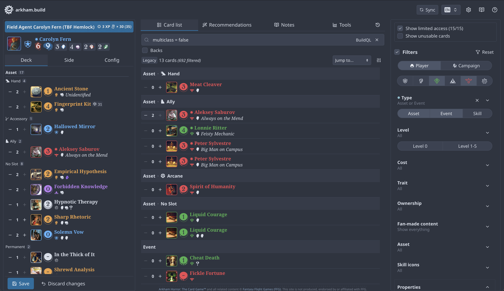

# arkham.build

> [arkham.build](https://arkham.build) is a web-based deckbuilder for Arkham Horror: The Card Game™.



## Project structure

The project is an `npm` workspace consisting of three packages:

- `frontend` (`./frontend`): React frontend
- `backend` (`./backend`): Node.js backend
- `shared` (`./shared`): Types, schemas and utilities shared between frontend and backend

## Command overview

```sh
# Install
npm i

# Lint
npm run lint

# Format
npm run fmt

# Test (workspace)
npm run test -w {workspace}

# Typecheck (workspace)
npm run check -w {workspace}

# Develop (workspace)
npm run dev -w {workspace}

# E2E test
npm run test:e2e

```

Individual workspaces may contain additional commands in their `package.json` file.

## Further reading

- see [docs/architecture.md](./docs/architecture.md) for a short overview of the app architecture.
- see [docs/metadata.md](./docs/metadata.md) for details about metadata formats.
- see [docs/translations.md](./docs/metadata.md) for instructions how to translate the app.
